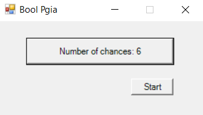
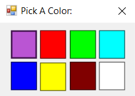
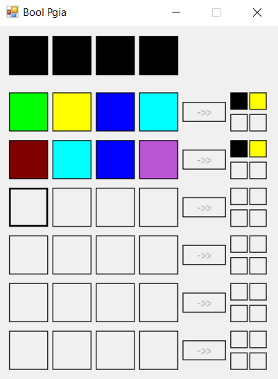
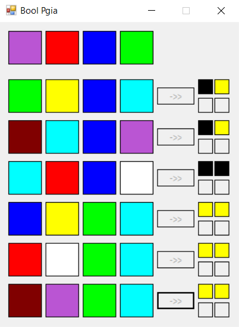
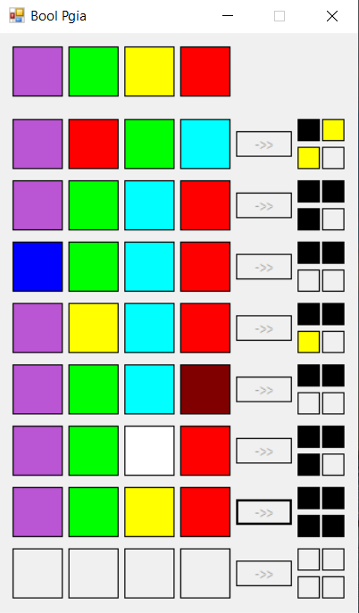

# Pigs And Bulls

Pigs And Bulls is a desktop application I develop using WinForms with C#.
The purpose of the game is to guess a sequence of 4 different colors.

## How to play
* At the start menu the user choose the number of guess (4-8).
* At each turn the user choose 4 out of 8 diffrent colors and place them in a row. 
* After submit his selection, for each right color in a right position the user get black square, for each right color in a wrong position he gets a yellow squre.
* If the user guessed the right sequence he will get four 4 black squares and the sequence will be revealed at the top of the screen

## Screenshots

 
 



## Built With

* [C#](https://docs.microsoft.com/en-us/dotnet/csharp/) -  is a general-purpose, multi-paradigm programming language encompassing static typing, strong typing, lexically scoped, imperative, declarative, functional, generic, object-oriented (class-based), and component-oriented programming disciplines.

* [Visual Studio ](https://visualstudio.microsoft.com/) - visual studio is  an integrated development environment (IDE) from Microsoft


```
